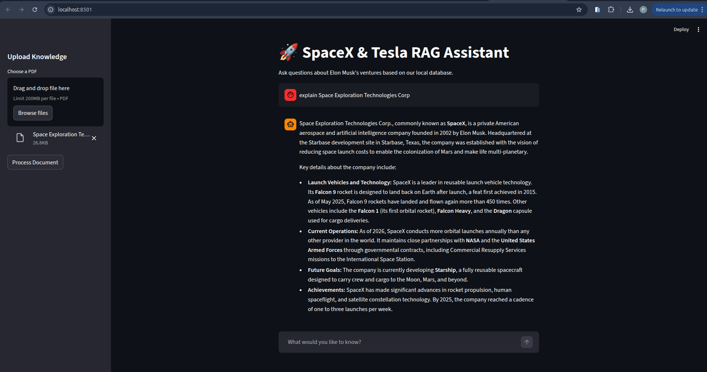
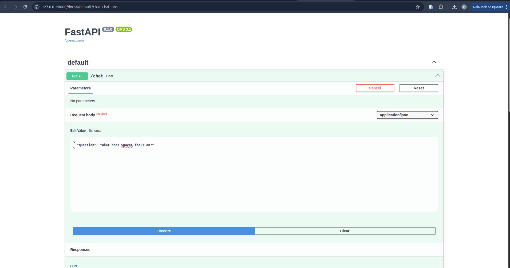
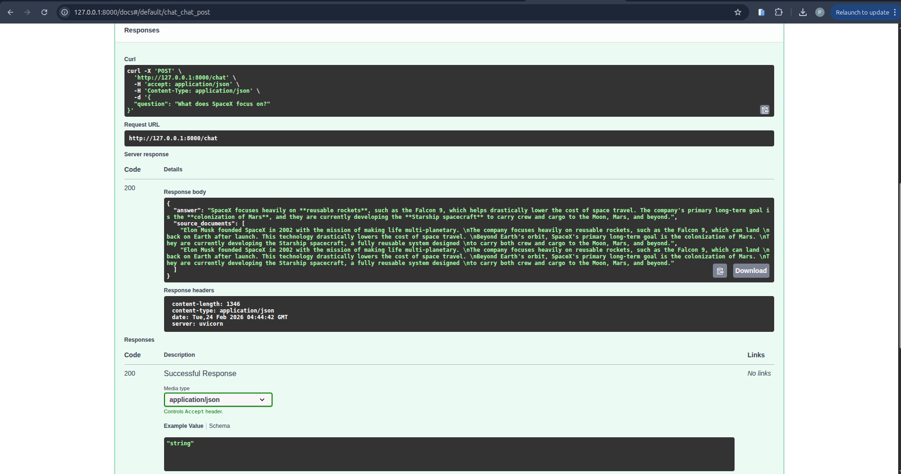

SpaceX & Tesla RAG Assistant

A production-style Retrieval-Augmented Generation (RAG) system built using FastAPI, Gemini, Chroma, and Streamlit.

This application allows users to upload PDFs, build a local knowledge base, and ask grounded questions using conversational memory.

Architecture Overview
High-Level Architecture
                ┌────────────────────┐
                │   Streamlit UI     │
                │  (Frontend Client) │
                └─────────┬──────────┘
                          │ HTTP Request
                          ▼
                ┌────────────────────┐
                │     FastAPI        │
                │   (RAG Backend)    │
                └─────────┬──────────┘
                          │
            ┌─────────────┴─────────────┐
            ▼                           ▼
   ┌──────────────────┐        ┌──────────────────┐
   │  Gemini LLM      │        │  Chroma Vector   │
   │ (Answer Generator)│        │     Database     │
   └──────────────────┘        └──────────────────┘
                                         ▲
                                         │
                                ┌──────────────────┐
                                │ Gemini Embedding │
                                │  Model           │
                                └──────────────────┘
RAG Pipeline Explanation

This project implements a full Retrieval-Augmented Generation pipeline:

1. Document Ingestion

User uploads a PDF

PyPDFLoader extracts text

Text is split into chunks

Each chunk is converted into embeddings using:

models/gemini-embedding-001

Embeddings are stored in Chroma vector database

2. Query Processing

When user asks a question:

Question is converted into embedding

Chroma performs similarity search (Top-K retrieval)

Relevant chunks are retrieved

Retrieved context is injected into prompt

Gemini LLM generates grounded answer

Memory stores conversation history

3. Conversational Memory

Using:

ConversationBufferMemory

The system supports:

Follow-up questions

Multi-turn conversation

Context-aware answers

Tech Stack:
Backend

FastAPI – REST API

LangChain – RAG orchestration

Chroma – Vector database

Gemini API – LLM + Embeddings

PyPDFLoader – PDF ingestion

Frontend

Streamlit – Chat UI

AI Models

gemini-3-flash-preview → LLM

gemini-embedding-001 → Embeddings

How To Run Locally

1. Clone Repository
git clone <your-repo-url>
cd spikra-AI-Task

2. Create Virtual Environment
python -m venv venv
source venv/bin/activate

3. Install Dependencies
pip install -r requirements.txt

4. Add Environment Variable
Create .env file:

GOOGLE_API_KEY=your_api_key_here

5. Run Backend
uvicorn main:app --reload

Backend available at:

http://127.0.0.1:8000/docs

6. Run Frontend
streamlit run streamlit_app.py

Frontend available at:

http://localhost:8501

Features

 PDF Upload & Dynamic Knowledge Base

 Conversational RAG

 Source Document Retrieval

 Local Vector Database Persistence

 FastAPI REST API

 Streamlit Chat Interface

 Screenshots:
 
 
 